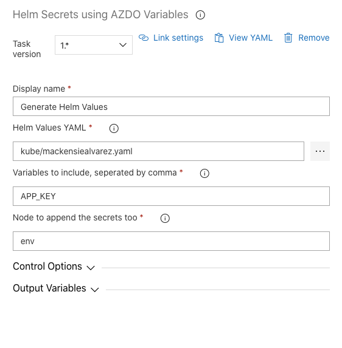

This extension provides build and release tasks for injecting variables inside of yalm files.

## How to use
All you have to do is provide:
1. The yaml file you want the secrets to be injected too
2. Which variables inside of your build do you want to include
3. What is the name of the node inside of the YAML where you want to place the secrets. 

The package will add the secrets inside of the file you provided

## Feedback and issues
If you have feedback or issues, please [send an email](mailto:mackensiealvarez@gmail.com)